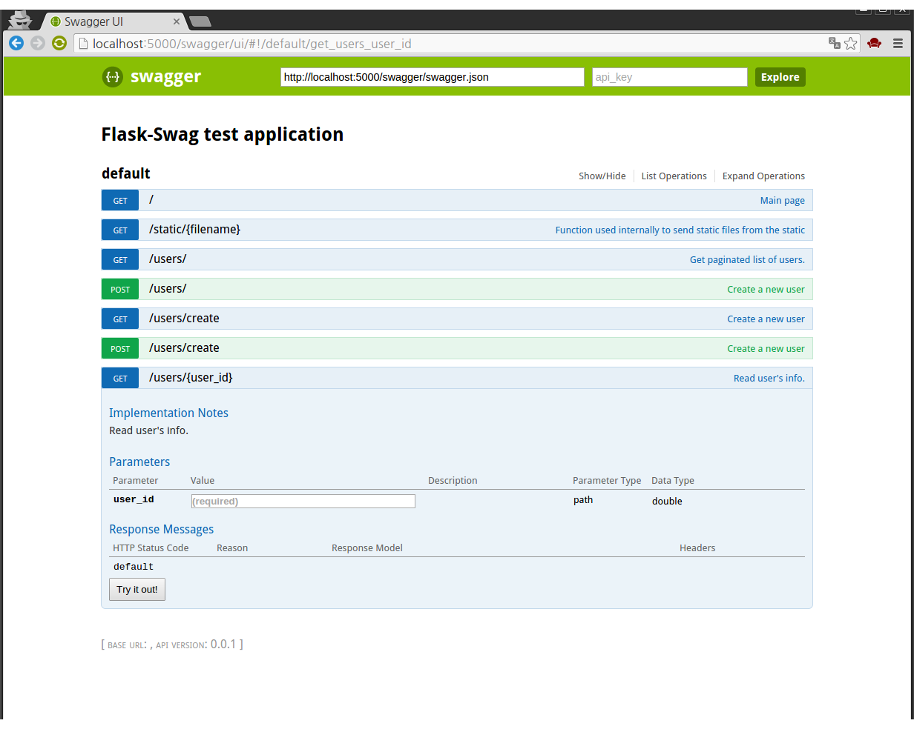

Flask-Swag
==========

Swagger spec extractor for flask.

It supports only python3.4 and higher.

.. image:: https://badge.fury.io/py/Flask-Swag.svg
   :alt: PyPI Version
   :target: https://badge.fury.io/py/Flask-Swag

.. image:: https://travis-ci.org/Hardtack/Flask-Swag.svg?branch=master
   :alt: Build Status
   :target: https://travis-ci.org/Hardtack/Flask-Swag

.. image:: http://readthedocs.org/projects/flask-swag/badge/?version=latest
   :alt: Documentation Status
   :target: http://flask-swag.readthedocs.org/en/latest/?badge=latest

.. image:: https://codeclimate.com/github/Hardtack/Flask-Swag/badges/gpa.svg
   :target: https://codeclimate.com/github/Hardtack/Flask-Swag
   :alt: Code Climate

How to use it
-------------

Flask-Swag is a Flask extesnsion.

You can configure by

.. code-block:: python

   from flask.ext.swag import Swag

   swag = Swag(app)

then, Swagger-UI will be served at ``/swagger/ui/``

You can add details to flask view functions.

.. code-block:: python

   from myapp.app import app
   from myapp.exts import swag

   @app.route('/some-list')
   @swag.mark.query('page', int)
   @swag.mark.response(200, "List of somethings.", some_list_schema)
   def some_list():
       pass

Documentation
-------------

You can find out more info at http://flask-swag.readthedocs.org/
