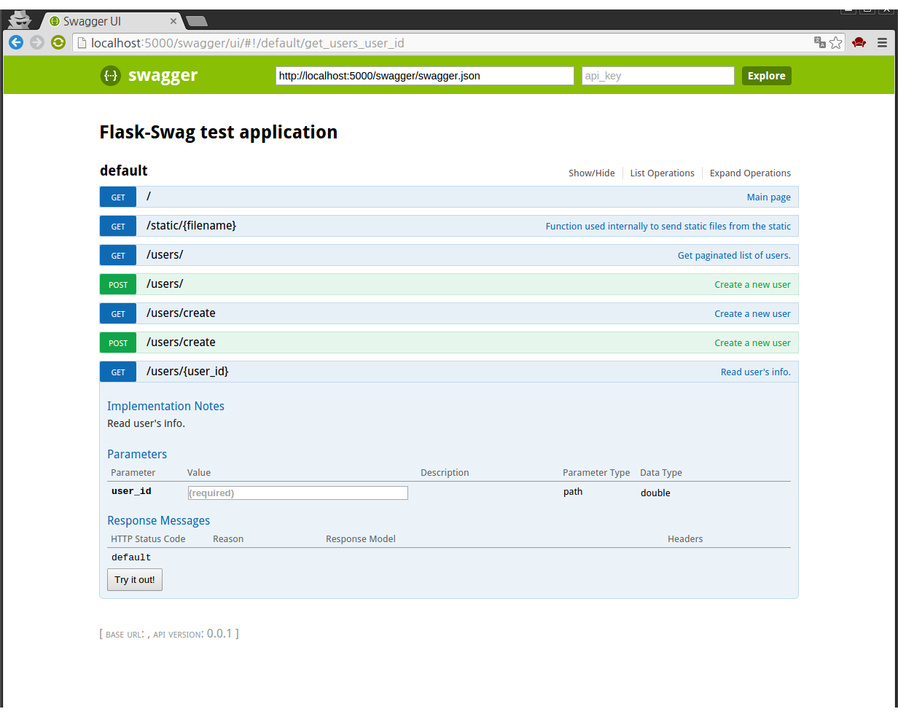

Quick Start
===========

This page is best point to getting started.

You can find out source code from https://github.com/hardtack/flask-swag

Configuring
-----------

There are two ways to configure your app for Flask-Swag, just like other
flask extensions.

First, you can configure on init ::

    from flask.ext.swag import Swag

    swag = Swag(app)

Or you can configure later ::

    from .exts import swag

    swag.init_app(app)

Swagger-UI
----------

By default, you may find out Swagger-UI on ``/swagger/ui/`` provided by blueprint.

You can customize Swagger-UI by configuring ``'SWAG_UI_ROOT'``
